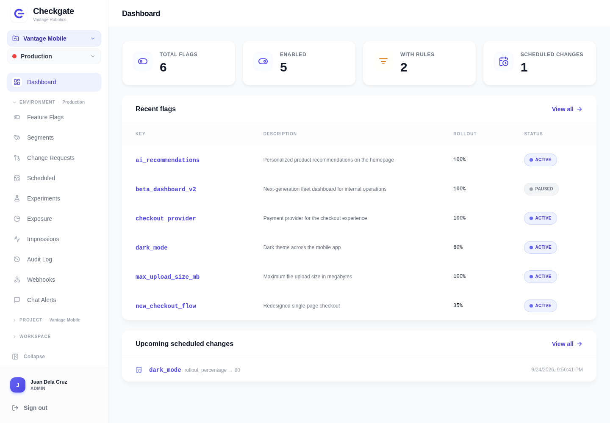
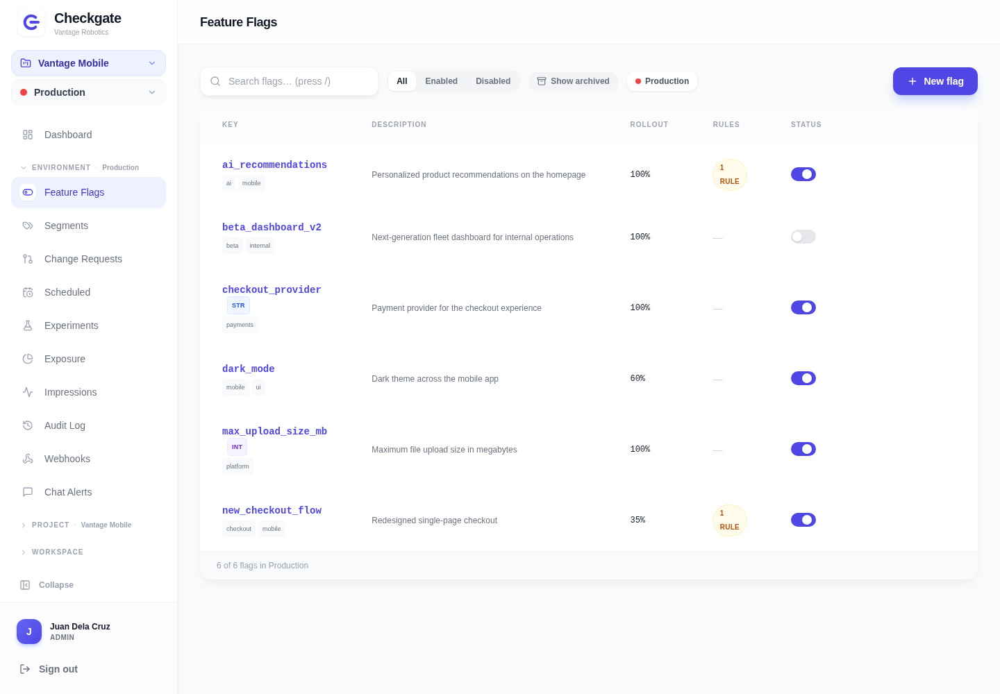
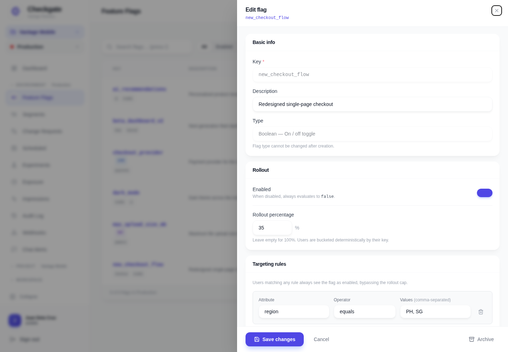
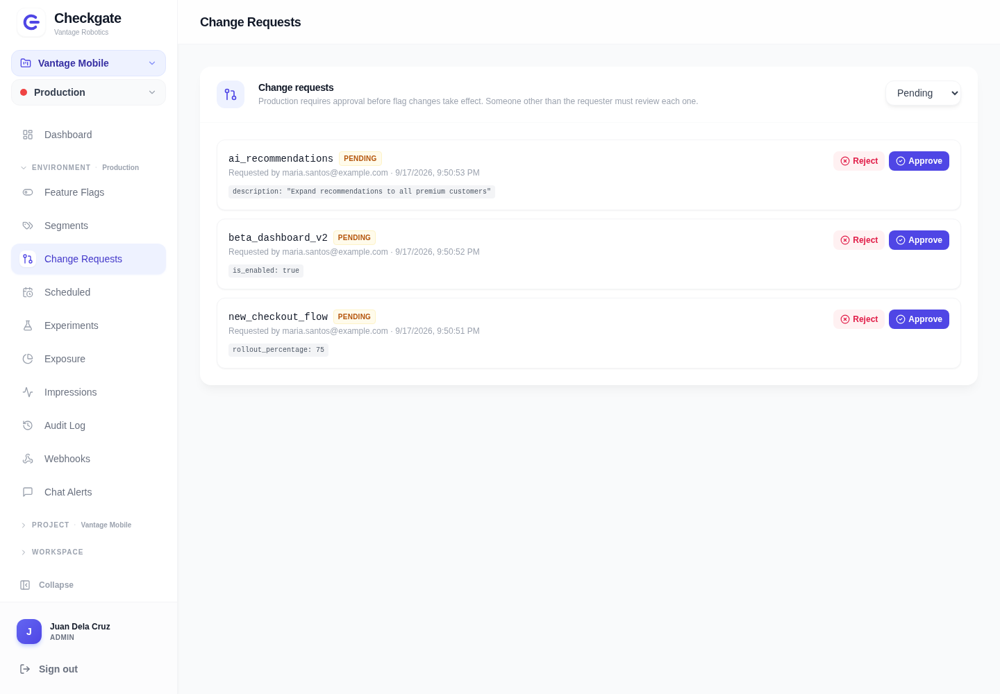
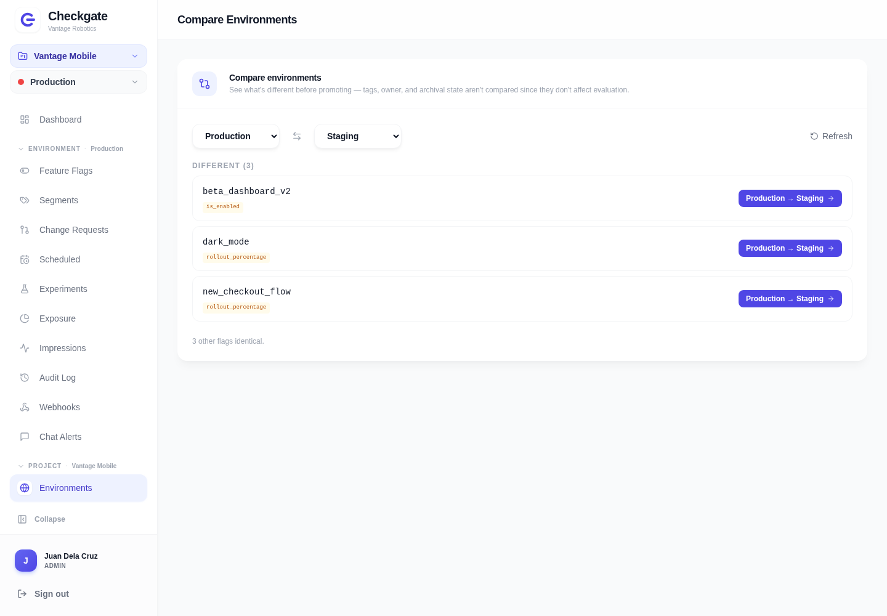
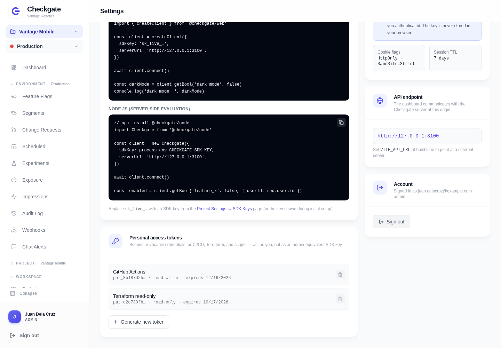
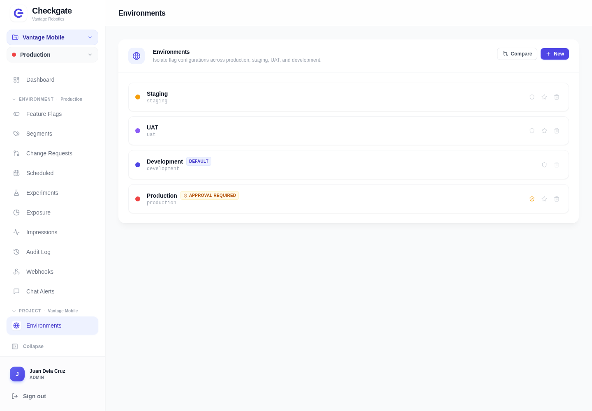
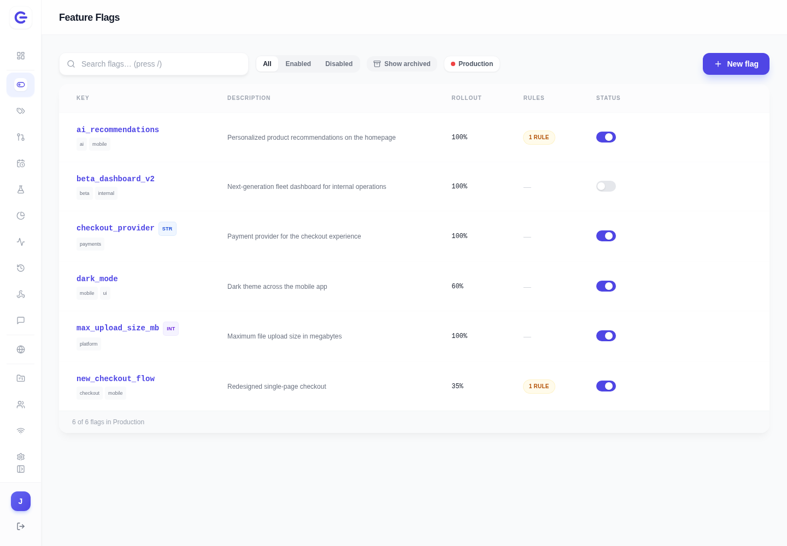

# Dashboard

The dashboard uses Checkgate's indigo brand color and gate logo for navigation, actions,
and enabled state. Amber highlights pending reviews, while gray marks inactive state.
These screenshots use example data for the fictional Vantage Robotics workspace, with
Juan Dela Cruz as its administrator.

## Overview

See flag counts, rollout status, and scheduled changes for the active environment.

## Feature flags

Manage flag types, tags, rollout percentages, and enabled state per environment.

## Flag editor

Edit targeting rules, ownership, tags, and prerequisites in the flag panel.

## Change requests

Review proposed changes before applying them in environments that require approval.
The requester cannot approve their own change.

## Compare environments

Compare flag configuration across environments before promoting a change.

## Personal access tokens

Create scoped credentials for CI/CD, Terraform, and scripts from Settings.

## Environments

Keep Production, Staging, UAT, and Development configuration separate, with approval gates
where your team needs a review.

## Collapsible sidebar

Collapse the sidebar to give tables and flag configuration more space.

